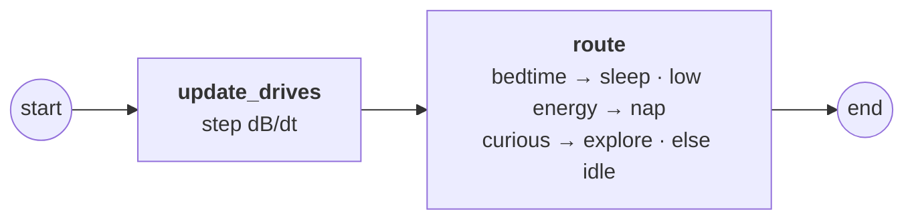
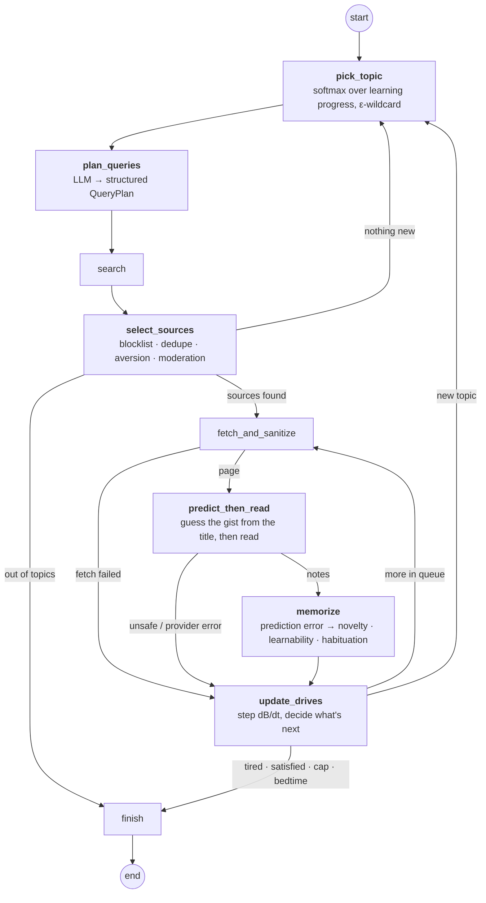
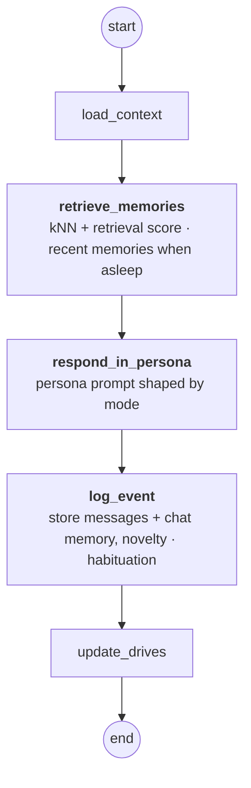
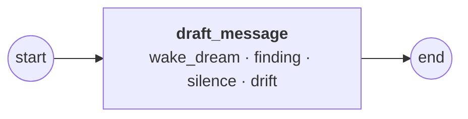
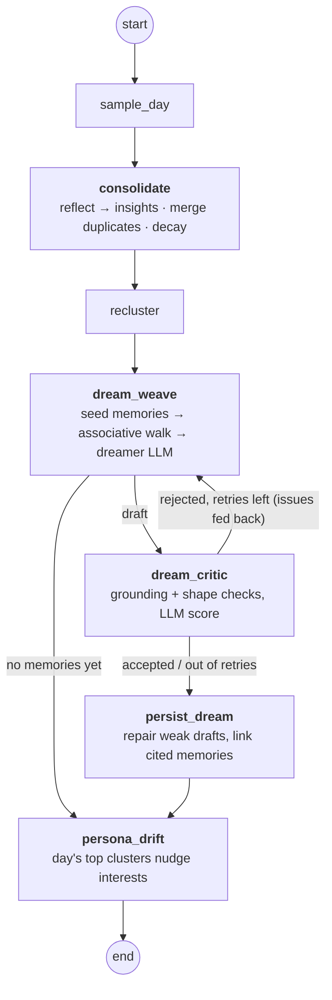
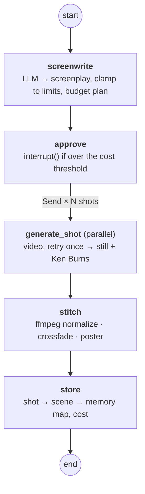

# Agent graphs

Every agent in Dream Pet is a LangGraph `StateGraph` in [`backend/dreampet/graphs`](../backend/dreampet/graphs). The scheduler picks which graph to run. It's a plain state machine, never an LLM. Graphs that do long or costly work are checkpointed after every node, so a crash resumes mid-run.

| Graph | Runs when | Checkpointed |
| --- | --- | --- |
| [awake_tick](#awake_tick) | every scheduler tick while awake | no |
| [explore](#explore) | the drives say "go look something up" | yes |
| [chat](#chat) | the owner sends a message (one thread per conversation) | yes |
| [proactive](#proactive) | the pet has something to say first | no |
| [sleep](#sleep-and-dream-weaving) | bedtime | yes |
| [video](#video) | a saved dream is rendered | yes |

Edge labels describe the routing condition. Rounded nodes are start and end.

## awake_tick

Steps the drives forward and then routes using fixed thresholds only, with no LLM call. The scheduler acts on `next`. ([`awake_tick.py`](../backend/dreampet/graphs/awake_tick.py))

## explore

The pet picks something it is curious about, guesses what a page will say before reading it, and learns most from what surprised it. Each read changes its drives, and the drives decide whether it keeps going, switches topic, or stops. ([`explore.py`](../backend/dreampet/graphs/explore.py))

## chat

One reply per invoke. The reply style depends on `mode` (awake, tired, grumpy after being woken, or sleep-talking). Each turn is stored as a memory and counts as a drive event, so chatting relieves boredom. ([`chat.py`](../backend/dreampet/graphs/chat.py))

## proactive

Drafts a message the pet sends first, triggered by waking from a dream, a surprising finding, a long silence, or a new interest. The scheduler decides when to send it. ([`proactive.py`](../backend/dreampet/graphs/proactive.py))

## sleep and dream-weaving

At night the pet consolidates the day into memory and reclusters it. It then weaves a dream from an associative walk over those memories. A critic checks that every scene is grounded in a real memory, and a rejected draft goes back to the weaver along with the critic's issues (up to 2 retries). ([`sleep.py`](../backend/dreampet/graphs/sleep.py), [`dreams/weave.py`](../backend/dreampet/dreams/weave.py))

## video

Renders a saved dream as a short film, on a best-effort basis. If the estimate exceeds the approval threshold, the graph pauses with a human-in-the-loop `interrupt` until someone approves or rejects it. Shots are generated in parallel through `Send` fan-out. Shots that go over budget or fail after one retry, and all shots in a rejected render, fall back to stills with a Ken Burns pan. With no ffmpeg, or if nothing rendered, the dream stays text-only. ([`video.py`](../backend/dreampet/graphs/video.py))

